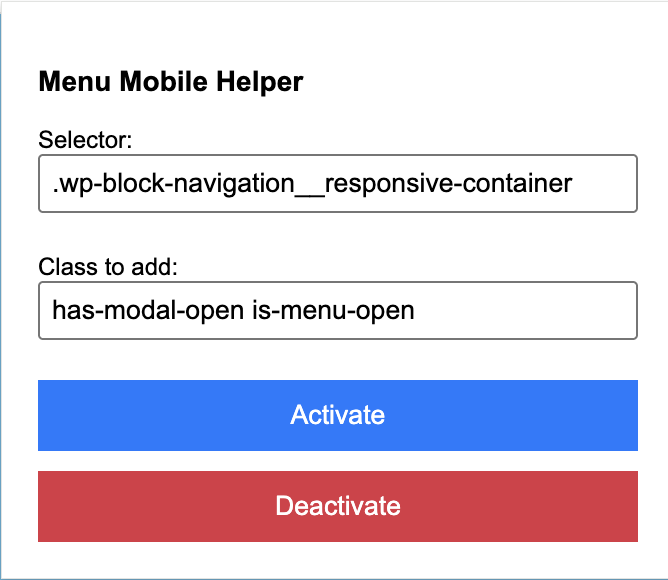
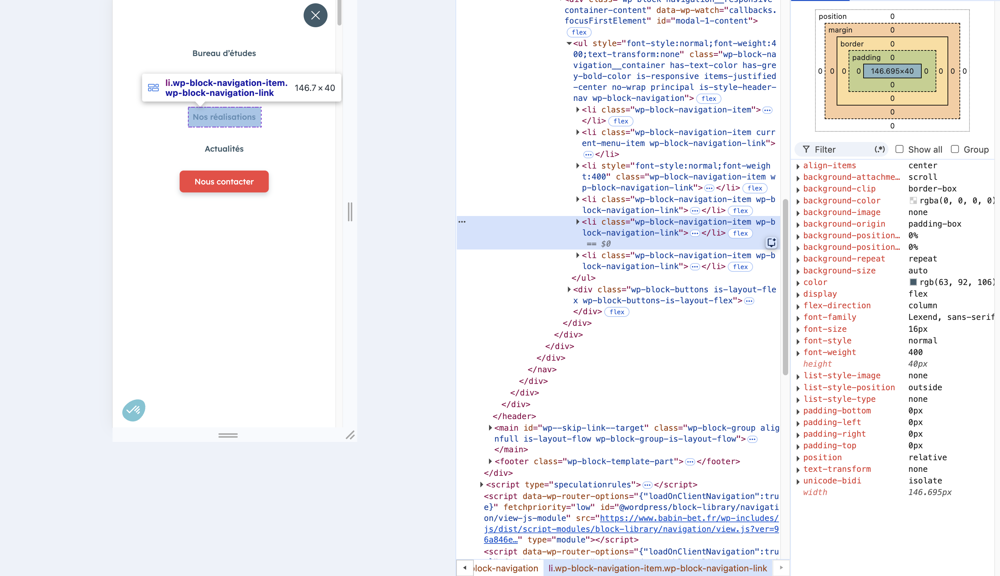

# Menu Mobile Helper

Chrome extension to temporarily add one or more CSS classes to elements matching a selector on the current page.

It was originally built for WordPress front-end debugging, especially mobile menus that close as soon as the page loses focus or the user clicks elsewhere. By forcing an "open" class, the menu stays visible long enough to inspect its HTML and CSS in DevTools.

## Why

Some mobile menus are difficult to debug because they close automatically on blur, click, scroll, or route changes.

This extension helps answer simple front-end debugging questions:

- Which element controls the open state?
- Which CSS class keeps the menu visible?
- What markup is rendered inside the menu?
- Which styles apply when the menu is forced open?

It is a debugging helper, not a production fix.

## Features

- Stores a CSS selector and class name locally.
- Provides default values for the WordPress core mobile navigation modal.
- Adds the class to all matching elements on the current page.
- Supports multiple classes separated by spaces.
- Reapplies classes when the DOM changes.
- Can be deactivated from the popup.
- Handles invalid selectors without breaking the page.

## Installation

1. Download or clone this repository.
2. Open Chrome and go to `chrome://extensions/`.
3. Enable **Developer mode**.
4. Click **Load unpacked**.
5. Select the extension folder.

## Usage

1. Open the page you want to debug.
2. Click the extension icon.
3. Use the default selector or enter your own CSS selector.

Default selector:

```text
.wp-block-navigation__responsive-container
```

4. Use the default classes or enter your own classes.

Default classes:

```text
has-modal-open is-menu-open
```

5. Click **Activate**.
6. Inspect the page with DevTools.
7. Click **Deactivate** when finished.

## Screenshots

### Popup Overview



### Menu Opened For Inspection



## Permissions

The extension uses:

- `storage`: to remember the selector, class name, and active state;
- `activeTab`: to interact with the current tab;
- `scripting`: to support Chrome extension execution features;
- `<all_urls>` host permission: to allow debugging on any page you explicitly open.

The extension does not send collected data to a remote server.

## Limits

- It only adds/removes classes; it does not change the site source code.
- It does not detect which class is the right one automatically.
- It may not work on pages where the target element is inside a closed Shadow DOM.
- It is intended for temporary debugging and screenshots, not production behavior.

## Development Notes

The class handling logic lives in `content.js`.

The popup stores the selector and class name in Chrome local storage, then sends activation/deactivation messages to the content script.

## Roadmap Ideas

- Add selector validation feedback in the popup.
- Add a button to pick an element from the page.
- Add presets for common WordPress menu patterns.
- Add a temporary highlight around matched elements.

## License

MIT License. See [LICENSE](LICENSE).
